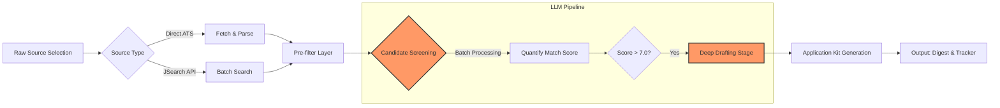

# JobFinder - AI-Powered Career Navigation

[](https://opensource.org/licenses/MIT)
[](https://github.com/sagarbhadouria/job-apply)


_A sophisticated automation and intelligence engine for navigating the modern job search process. JobApply takes you from a raw resume to curated, tailored application content by leveraging Large Language Models (LLMs) at various stages of the funnel._

## 🌐 Live Project

Try out the live generator here:

🔗 **[JobApply Demo](https://job-apply-demo.vercel.app)**


## ✨ Features

- AI-powered job discovery and filtering from multiple ATS platforms
- Intelligent deterministic pre-filtering to minimize LLM costs
- Two-stage LLM intelligence balancing cost and quality
- Multi-source integration with Greenhouse, Lever, Ashby, JSearch, and more
- Configurable candidate profiles and search filters
- Batch processing for high-volume job description screening
- Application kit generation with cover notes and tailored bullets
- Remote-friendly location logic and recency checking

## 🧠 How It Works

The project follows a **five-stage funnel**:

### 1. Fetch
Jobs are sourced from public ATS APIs (Greenhouse, Lever, Ashby, SmartRecruiters, Workday, Breezy, BambooHR) or the JSearch aggregator. No auth, no scraping, no ToS risk. If `--jsearch` is used, companies are auto-discovered from a role/location query; otherwise `companies.yaml` lists the boards to scrape.

### 2. Prefilter (deterministic, free)
Before any LLM call, a cheap deterministic filter drops jobs that don't match:
- **Title filter**: includes/exclude keywords
- **Location filter**: city/region match or remote allowance
- **Freshness filter**: max age in days since posting

This reduces ~2000 raw jobs to ~40 candidates for ~0 cost, so the LLM only ever reads jobs that already passed title + location + freshness checks.

### 3. Screen (cheap LLM pass)
The first LLM stage scores every surviving job 0–10 on genuine fit using the candidate profile. Batches of ~8 jobs are processed with the JD truncated to ~1400 chars and the cheapest available model. Output: `score` + one-sentence `reason`.

### 4. Draft (expensive LLM pass)
Only the top-scoring jobs (default threshold 7.0, max 5) advance to the drafting stage. One LLM call per job with ~6000 chars of JD and the best model. Output: `fit_summary`, `tailored_bullets`, `gaps`, `cover_note`, `questions_to_ask`. Hard rule: never invent experience — every claim traces to the profile, gaps are listed honestly.

### 5. Digest (HTML output)
The final HTML digest renders each shortlisted job as a card showing:
- Title + score badge
- Company + location + ATS tag
- "Why it fits" summary
- 3–4 tailored resume bullets
- Honest gaps + how to address them
- Cover note (edit before submitting)
- 2 sharp questions to ask the employer
- "Open & apply →" link to the original posting

The digest also includes a tracker CSV and stats on scanned/filtered/new jobs.

## 🔀 Core Workflow



## 🚀 Quick Demo

<details>
<summary>Expand to view quick demo</summary>

|                                                                               Demo                                                                               |
|:----------------------------------------------------------------------------------------------------------------------------------------------------------------:|
|  |

</details>


## 🧭 Getting Started

### 🔧 Prerequisites

- Python 3.9+
- pip (Python package manager)

### ⬇️ Clone Repository

```bash
# Clone the repo
git clone https://github.com/sagarbhadouria/job-apply.git
cd job-apply
```

### 🛠️ Setup Project

```bash
# Create virtual environment
python -m venv .venv

# Activate virtual environment
.\.venv\Scripts\activate

# Install dependencies
python -m pip install -r requirements.txt

# Test installation (If you see a mock job search and a generated digest, your installation is working)
python -m jobfinder run --mock --scorer keyword

# Generate a profile (profile.json) from your resume (PDF or text)
python -m jobfinder profile --resume path/to/your/resume.pdf

# Set up environment variables (supply your own API keys in .env)
cp .env.example .env
````

### ▶️ Run the Application

```bash
# Run the application in standard mode with limited job search (no email notifications)
python -m jobfinder run --limit 10

# Run the application in standard mode with full job search (no email notifications)
python -m jobfinder run

# Run the application in standard mode with full job search and send email notifications (ensure SMTP settings are configured in .env)
python -m jobfinder run --send

# Run the application in JSearch mode for broad market exploration (no email notifications)
python -m jobfinder run --jsearch

# Run the application in JSearch mode for broad market exploration and send email notifications (ensure SMTP settings are configured in .env)
python -m jobfinder run --jsearch --send
```

## 📚 Usage Guide

1. **Configure Profiles**: Edit `config.yaml` to define your title keywords, locations, and filters
2. **Prepare Profile**: Run the system to generate your `profile.json` from your resume (PDF or text)
3. **Run Pipelines**:
   - Use standard mode for targeted company hunting
   - Use `--jsearch` mode for broad-scale market exploration

## 🗂️ Project Structure

```
job-apply/
├── README.md                                    # Project documentation & usage guide
├── companies.yaml                               # ATS company configurations (slugs, board names)
├── config.yaml                                  # Pipeline settings (filters, thresholds, LLM configs)
├── jobfinder/                                     # Main Python package
│   ├── __init__.py                              # Package initialization
│   ├── __main__.py                              # Entry point (`python -m jobfinder`)
│   ├── cli.py                                   # CLI argument parser and pipeline orchestrator
│   ├── digest.py                                # HTML digest builder with inline CSS
│   ├── fetch.py                                 # ATS API fetchers (Greenhouse, Lever, Ashby, etc.)
│   ├── jsearch.py                               # JSearch aggregator API client
│   ├── llm.py                                   # Two-stage LLM screening & drafting
│   ├── mailer.py                                # Email sending functionality
│   ├── mock.py                                  # Mock data for testing without API keys
│   ├── providers.py                             # LLM provider abstraction (Anthropic, Gemini, Groq, Ollama)
│   └── store.py                                 # seen.json dedupe index + tracker CSV export
├── profile.example.json                         # Sample profile JSON for reference
├── requirements.txt                             # Python dependencies
├── seen.json                                    # Dedupe index + application tracker
└── tests/
    ├── __pycache__
    ├── test_llm.py                              # LLM unit tests
    └── test_parsers.py                          # ATS parser unit tests
```

## ⚙️ Tech Stack

- **Backend**: Python, LLMs (Anthropic, OpenAI)
- **Tools**: JSearch API, Scrapy-style parsing, Regex
- **Deployment**: Vercel

## 📄 License

This project is licensed under the [MIT License](https://opensource.org/licenses/MIT).


## 🤝 Contributing

Contributions are welcome! Please feel free to submit pull requests to improve features, fix bugs, or suggest enhancements.

## 📜 Credits for Derivatives

If you create a new project or application by modifying or building on top of this code, please include the following in your README:

> This project is based on [Spring Boot Project Generator](https://github.com/callme-ocean/spring-project-generator) created by Sagar Bhadouria </br>
> Licensed under the [AGPLv3](https://www.gnu.org/licenses/agpl-3.0.html).

This helps preserve proper attribution while complying with license requirements.

## 🤔 Future Steps

- Improve UI/UX
- Add more ATS platform integrations
- Implement advanced filtering options
- Enhance LLM prompt engineering for better output quality
